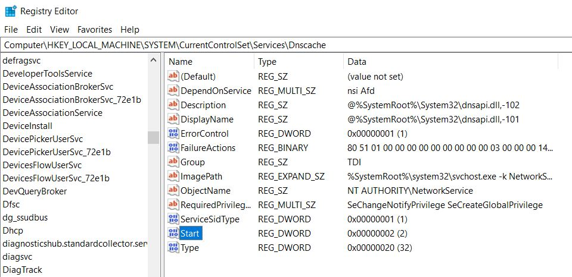

This article assumses you are already running Wsl 1 on your system and your windows
version is atleast 2004.

To check your windows version:
1. Press the Windows + R keys
1. Type `winver` in Run window

Now just for the purpose of confirmation, Let's check that you are actually running a Wsl 1:
1. Open PowerShell
1. Check the version with `wsl -l -v`<br />
Now if you see 1 in version column, then yes you are running wsl 1
1. Update the version with `wsl --set-version Ubuntu 2`

>Replace Ubuntu with what ever distro you are running

Now if that command worked for you, you can skip this whole part cause you have successfully upgraded to Wsl 2.

<hr />

If that did not work for you and you got an error like this:

```terminal
Conversion in progress, this may take a few minutes...
For information on key differences with WSL 2 please visit https://aka.ms/wsl2
Please enable the Virtual Machine Platform Windows feature and ensure virtualization is enabled in the BIOS.
For information please visit https://aka.ms/wsl2-install
```

You will have to enable Virtual Machine Platform from settings, to do that:
1. Type `Windows features` in usual window search option at the bottom left on taskbar
1. Now, find and check Virtual Machine Platform from those options

Alright, so try to run update version command again. If it works that's great


<hr />

But if you are still getting the same error.

The problem now is with hyper-v. I know the error message doesn't exactly say that but I've found, hyper-v is a required when running Wsl 2.
If you want to read more about it, Refer this [link](https://github.com/microsoft/WSL/issues/5363)

Now to enable that, you can just do it from the same windows features menu 
or you can type these commands in powershell:

```powershell
DISM /Online /Enable-Feature /All /FeatureName:Microsoft-Hyper-V
bcdedit /set hypervisorlaunchtype aut
```

Restart your system when the process finishes.

Try to run the update command again,

```powershell
wsl --set-version Ubuntu 2
```

If it worked, wsl 2 is running successfully.

<hr />

But again if you get an error which is looking like this, then:

```terminal
Conversion in progress, this may take a few minutes...
For information on key differences with WSL 2 please visit https://aka.ms/wsl2
The RPC server is unavailable.
```

So, now there are 2 ways to fix this,
1. Reinstall the OS (distro), I wouldn't really call this a fix but we can
get rid of the error
2. Enable DNS Client service on your system

Now to enable the DNS client, it is probably best if you follow this [link](https://wintechlab.com/enable-disable-dns-client-service/)

In this link, I had the same issue they have shown where the service was 
greyed out and I was unable to start it. To resolve it, I took the steps 
mentioning regedit. 



In that I found my start setting already showed 4 so I decided to make it 2
so that it can be automatic and restarted my PC. 

Again I tried update command and this time It worked perfectly
```powershell
wsl --set-version Ubuntu 2
```

But it took hours to finish. At one point I even thought of just stopping 
it cause there was no feedback that is it still working or is the process
just stuck. But I found if you see task manager and the disk usage is around
100% and a process named `vmmem` is running then yes conversion is still working.

If you dont want to wait that long then you should just consider uninstalling 
the current ubuntu and reinstall it again. I found this [link](https://www.digitalocean.com/community/posts/trying-the-new-wsl-2-its-fast-windows-subsystem-for-linux) 
easy to follow, I suggest taking backup of projects before doing this, 
cause everything will be cleared.


>Everything is new now, so why don't you try one more thing. You must have noticed that your whole Ubuntu is on your main system drive if you use it for a long time, it can take up a huge amount of space.<br /><br />I found that it is possible to move distro to another drive. We can do it with running some commands in powershell. But I've found [this](https://github.com/pxlrbt/move-wsl) amazing script that can do it very easily. Go head and try it. It worked perfectly for me.  

Let me know, If you still have some problems following any of the part or 
maybe got a completely different kind of an error. I'd be happy to help.
